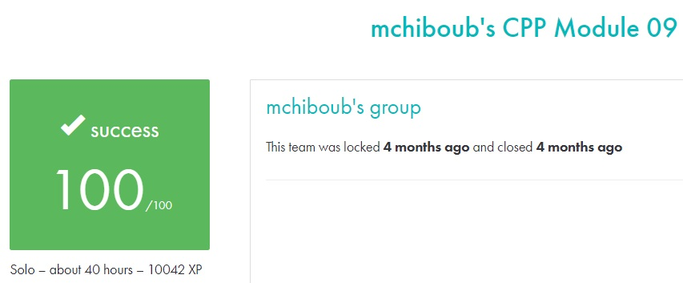

# C++ module 09 #

## What the project does: ##
The C++ - Module 09 project focuses on the Standard Template Library (STL) in C++. It involves solving exercises like calculating Bitcoin exchange values using historical data, evaluating mathematical expressions using reverse Polish notation (RPN), and implementing the merge-insert sort algorithm for large integer sequences.

## Why the project is useful: ##
This project is useful because it emphasizes the use of STL containers and algorithms, which are fundamental tools in C++ for efficient data handling. By working with containers and advanced sorting techniques, you'll gain a deeper understanding of how to manage large datasets, optimize performance, and write clean, reusable code.

[Subject of this project](en.subject.pdf)